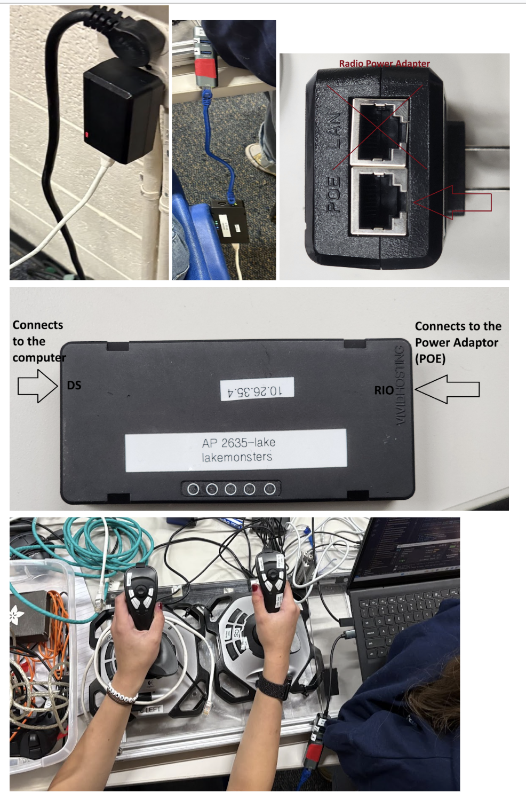
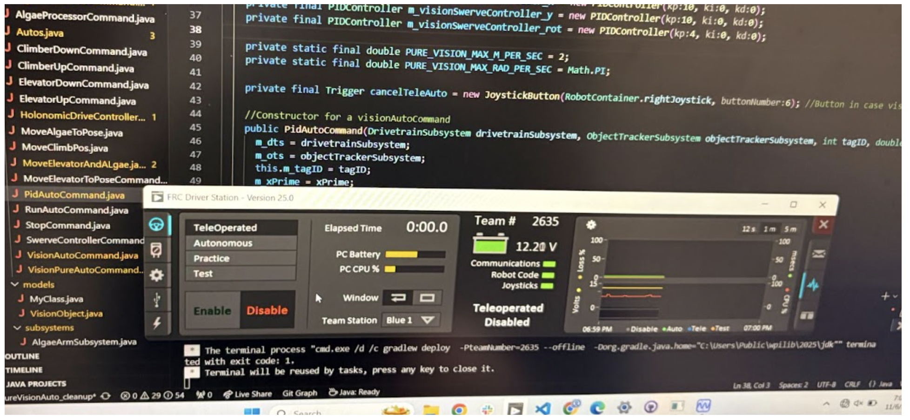

# Drive Station Setup for DRIVE TEAM!!!
- made by julie al-otoom
- [Extra info on radio/controller setup by Suleyman](https://docs.google.com/document/d/1GJuiOsG_LD7BDZ0magH3Mowrto_uFdIzVgmyK38oHLI/edit?usp=sharing)
## 1. Get an epic robot for driving
This step is self explanatory... just make sure that software has confirmed the robot is good for driving. Get two batteries and verify they are at least 80% and are of good/new quality, and put them in the robot. Turn on the robot!
## 2. Setup connections
Once you have your robot enabled, get a working software computer. This used to be krypton reborn but he was recently unborn… so we now use Praseodymium as it is the most common. Though other computers should work.

If you are using two controllers, plug in your “0-Left” controller into a multi-port adapter, having it be plugged into the `first adapter port`. Having it out of order will not allow the driver station to correctly connect. The “1-Right” controller should be plugged into the `second adapter port`. Plug the whole adapter into the `first COMPUTER port`.

Depending on the kind of radio on the robot, there will be a specific process to connect your computer to the robot. On some robots you may not need to do any radio setup on the computer, while with others you may need to have the computer connected by ethernet to a radio. Below are steps to connect to a robot that **DOES** need external radio setup:

### Radio setup
- Radio adapter
- 2 Ethernet cables
- One Ethernet to USB-A dongle
- Radio programmed to Access Point

### Steps:
- Plug in the Radio Adapter to a socket
- Plug in one of the Ethernet cables to the “POE” of the adapter
- Then plug in the other end of the cable to the “RIO” port on the radio. (The radio should light up after this point)
- Then plug in the second Ethernet cable to the “DS” port on the radio
- Plug in the other end of the dongle, which is connected to the computer.

Here are visuals on how exactly the setup looks:

### On the computer, connect to the robot through your WiFi settings. You are now connected!
## 3. Deploy code
Open “2025 WPILib Code” (search for it in the Windows application search thing), and open the repository that matches with the robot we are using. If it opens on the homepage, it should list recent repositories. You can select your desired repo from here.

If it does not open at the homepage or does not show the repo we want, then at the top, click “File” → “Open Folder”. The location of the repo folder depends on where Software decided to put it (and also which computer you are using) but the path SHOULD be under `'This PC' -> C -> dev folder -> (repository name)`. If the folder isn’t there, consult your local software member!

Next, click the settings icon in the bottom left corner, select “Open Command Palette”, then search for “Deploy Robot Code.” This will deploy the code onto the robot (and build code if needed).

Once it is finished, open the driver station panel (FRC Driver Station). It either automatically opens, or you can search for it on the Windows search feature.

In the driver station panel, click the USB symbol on the left side, and reorder your controllers:
- 0-Left → first
- 1-Right → second

Once you reorder it, they should now be connected correctly. Pressing the buttons or moving the joystick should be detected. If not, there should be an option to reconnect or refresh.

Click back to the steering wheel symbol on the left. Make sure:
- Communications
- Robot Code
- Joysticks

…are all working (they will show as green).

## 4. (optional) Streamdeck setup
Take the streamdeck out of the box, and use the cable in the box to connect the streamdeck to the right USB port on the computer as shown in the images:

Now, open a `NEW WINDOW` in VSCode, and look for the streamdeck repository. Once opened, run the `streamdeck.py` file. There should be new symbols on the streamdeck.

## 5. Driving the robot

- When you have verified everything works, click on “TeleOperated” mode.

- When you are about to drive, make sure you have an operator with you to E-Stop if needed (pressing Enter will automatically disable to do this).
### Enabling the robot
Make sure the area around it is safe (no person or important item is near the robot and is at risk of being obliterated) then say “Robot enabling” loudly as you press `ENABLE`.
### Disabling the robot
Press `DISABLE` (you can also press the `Enter/return` key to disable quicker in an emergency situation).

## 6. Troubleshooting

Below are common issues with the robot from this year (or past years) and how they can be improved.

### Shaky/jittery movement, randomly being slow/stopping
The battery is either very low or it's just a bad quality battery :( check the voltage through the Driver Station panel or using the battery beak for better reading, and switch out the battery. Even if the battery is not low or not bad quality, it is best to try switching to another battery if possible.

### (on the main season bot 2024-2025) Increased tipping/instability
Don't move so fast while the elevator is up!! We can't fix this unfortunately, it's just how it was designed

### (on the main season bot 2024-2025) Elevator string unspooling
i hate when this happens

you have to get a specific wrench (note to self, be more specific here!) and spool it again, try not to have it be super tight (or maybe do? i dont remember ask huda)

#### To submit edits to drive manual, [make an issue :)](https://github.com/montypythonist/driveteam/issues/new)
